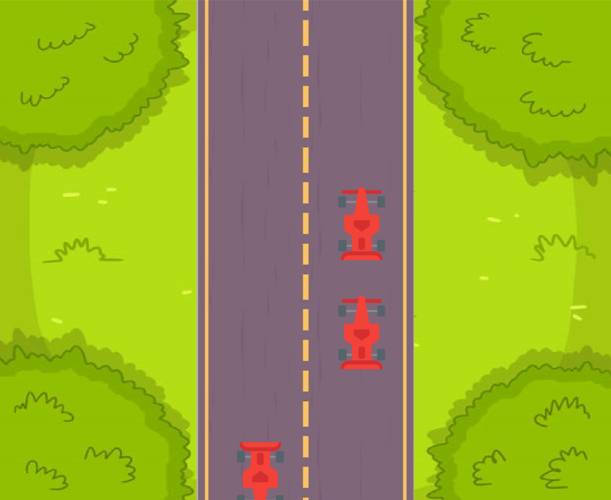
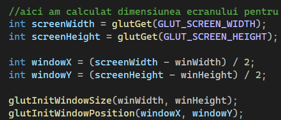
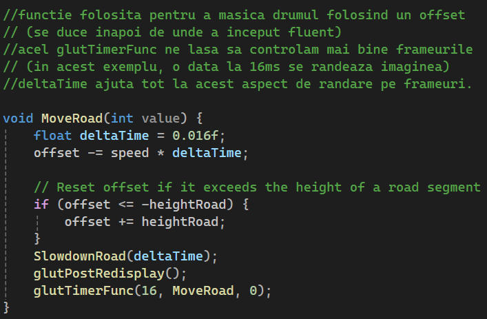
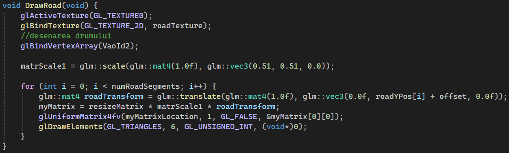
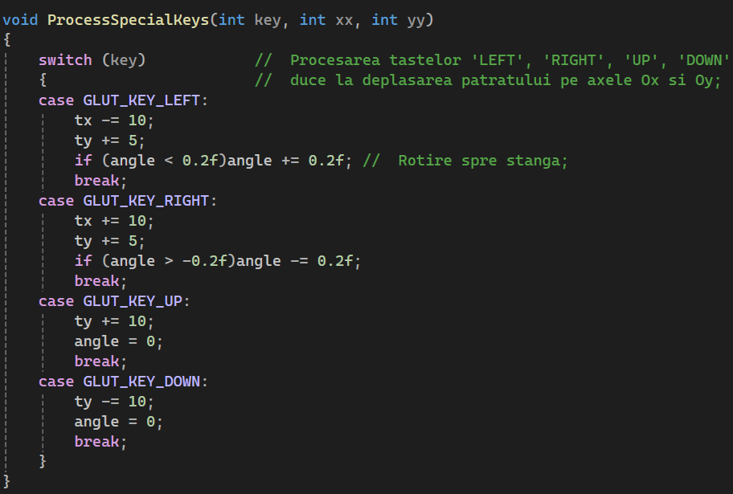
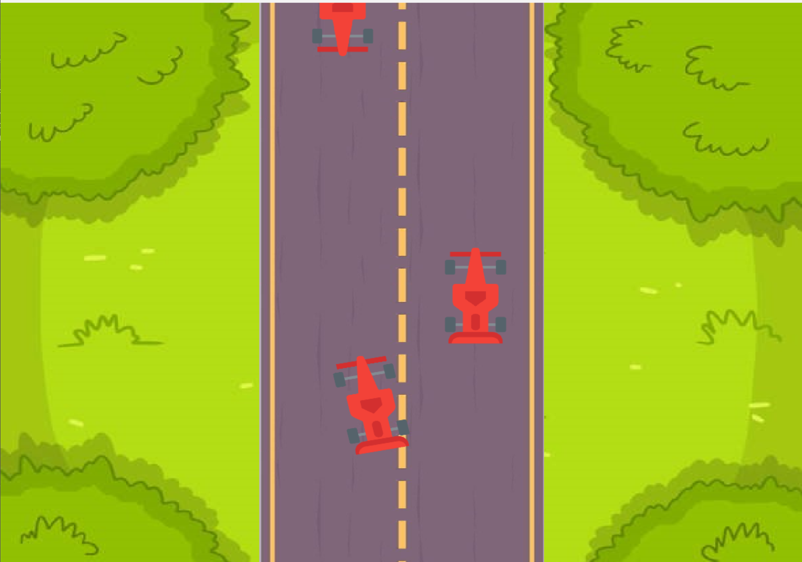
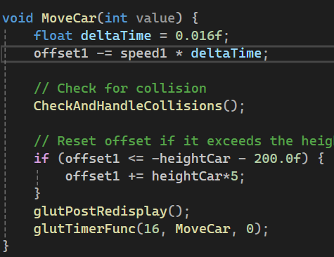
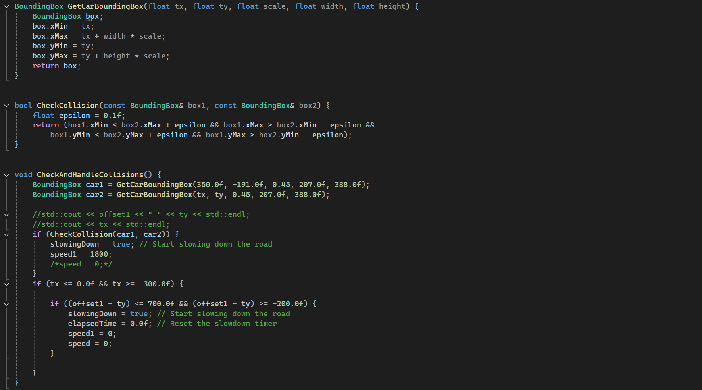

# Documentatie


### Conceptul proiectului

Proiectul include 2 masini (tip Formula 1) care merg pe o strada prin padure, iar cea din spate doreste sa faca o intrecere periculoasa. 
Constant, vin masini si din sens opus si exista sansa de a face un accident daca nu este antenta masina nerabdatoare.

### Transformari incluse
Au fost folosite majoritatea transformarilor prezentate la curs, anume: 
- translatii pentru a face iluzia ca masinile se misca
- scalare pentru a modela dimensiunea obiectelor pe ecran (masina, strada, background)
- rotatie pentru virajele masinii

### Originalitatea
Aplicatia este conceputa pentru lucru in echipa, anume au fost create fisiere .h pentru gestionarea
diferitelor obiecte individual de main.cpp. Astfel este usor de schimbat un obiect, si exista un pattern in programul principal
pentru a adauga texturi noi si (vao,vbo,ebo) nou.

In plus, a fost creat un drum infinit folosind doar 5 obiecte 
(fiecare bucata este miscata pe axa oy cu o viteza constanta pana ajunge sa parcurca lungimea acesteia, apoi este translatata in pozitia ei originala)

De asemenea, aplicatia dispune de detectarea coliziunilor intre masini, iar daca ecestea se lovesc, se si opresc.

### Capturi de ecran / explicare cod

1. Aplicatia este centrate pe ecran, ce am reusit sa facem prin aceasta parte de cod: 


2. Masinile sunt de tip `png`, deci a fost schimbat LoadTexture pentru a accepta `RGBA`
 si au fost aduagate aceste linii de cod pentru a face posibil un background invizibil pentru masini.
 	```cpp
    glEnable(GL_BLEND);
	glBlendFunc(GL_SRC_ALPHA, GL_ONE_MINUS_SRC_ALPHA); 
    ```

3. Functia pentru miscarea drumului: 


4. Drumul a fost creat dinamic, si pus patratele unele sub altele pana au umplut imaginea.


5. Pentru miscarea masinii folosind tastatura exista functia ProcessSpecialKeys si o translatie 
cu variabile, schimbate in aceasta functie la fiecare frame. In plus, cand se misca in stanga si in dreapta se face o rotatie.



6. Miscarea masinii de pe sensul opus se afla in aceasta functie: 


7. Coliziunile s-au realizat prin calcularea de distante intre masini folosind scaderi intre coordonatele
obiectelor ce isi modifica pozitia, sau incadrarea intre anumite intervale pentru obiectele statice


### Contributii individual

- `Bivol Mihai` a facut obiectele (masina cu textura, strada, background) si miscarea drumului la infinit.

- `Varona Antoniu` a facut posibila miscarea masinii folosind tastatura, crearea masinii din sens opus, translatarea ei pe sensul oy, si coliziuni.
